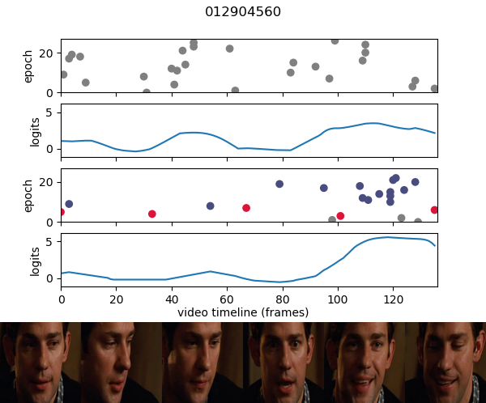
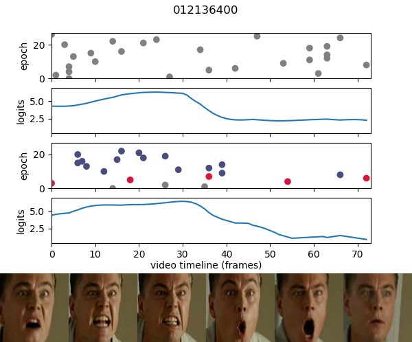

## Temporal Stochastic Softmax
Original PyTorch implementation of Temporal Stochastic Softmax, with inflated VGG for emotion recognition in AFEW video dataset.
 

  
   

Read [our WACV paper](https://openaccess.thecvf.com/content/WACV2021/html/Ayral_Temporal_Stochastic_Softmax_for_3D_CNNs_An_Application_in_Facial_WACV_2021_paper.html) for more information (<i>Temporal Stochastic Softmax for 3D CNNs: An Application in Facial Expression Recognition, Théo Ayral, Marco Pedersoli, Simon Bacon and Eric Granger, 2021</i>).

This code is intended to help integrating stochastic softmax with other models.
The dataset object maintains a list of explorated clips (`afew.py`).
The training loop updates the temporal score distribution of each video example (`trainer.py`). These distributions are used by the datasampler (`afew.py`) to select clips efficiently. Multiprocessing and files are used to handle communication between the dataloader and the training loop (synchronize training steps, sampling strategy, temporal distributions, etc.).

### Inflated 3D CNNs
This project also contains the code for inflating the 2D model to 3D CNN.
Examples of 2D pretrained vgg model: 
https://github.com/XiaoYee/emotion_classification
https://github.com/prabhuiitdhn/Emotion-detection-VGGnet-architecture-fer2013

2D models can be inflated with inflate.py to build and save a 3D model as vgg_3d.pth to then be finetuned.

#### Videotransforms
Videotransforms are PyTorch tensor transforms provided by [Yana Hasson](https://github.com/hassony2/torch_videovision) for consistent data augment in videos.

